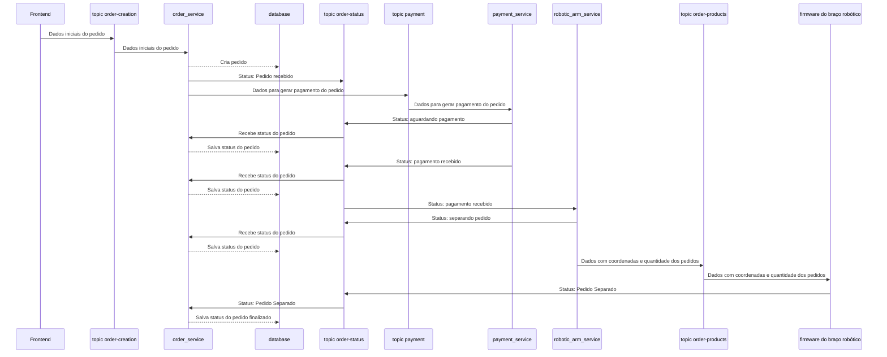

# grabber-backend
Backend repository for the robotic arm project

## Possui dúvidas?

> Dúvidas sobre como rodar testes? Dúvidas sobre como usar o docker?

Se você tem dúvidas sobre como realizar algumas ações no projeto, temos a seção de dúvidas na wiki do projeto: [FAQ - Perguntas Frequentes](https://github.com/UNB-PI2-Grupo3-BracoRobotico/grabber-backend/wiki)

# Instalação

## Subindo os microsserviços

```sh
docker compose up -d
```

Este comando irá realizar a build e deixará disponível todos os containers da aplicação.

# Execução

### 🚨 Tutorial KAFKA
[Video: como usar o kafka nesse projeto](https://youtu.be/7xh3CTJqkVM)

Execute a aplicação com o comando:

```sh
docker compose up -d
```

### Interface para o Kafka

Para visualizar os tópicos e as mensagens que estão sendo enviadas, acesse a interface do Kafka em http://localhost:8080

Nessa interface é possível visualizar e criar mensagens para os tópicos do kafka.

---

## Diagrama representando comunicação entre os tópicos e os microserviços

Diagrama representando o fluxo de um pedido que foi realizado corretamente e houve sucesso em todas as etapas do pedido



## Milestones

Cada parte destacada representa um pedaço do software que deverão ser construidos e testados.
Essa divisão torna possível o desenvolvimento em paralelo de cada parte.

Esse diagrama omite algumas operações que deverão ser feitas no banco de dados. Lembrem-se de implementar as operações com o banco de dados.

### Fluxo do Pedido

