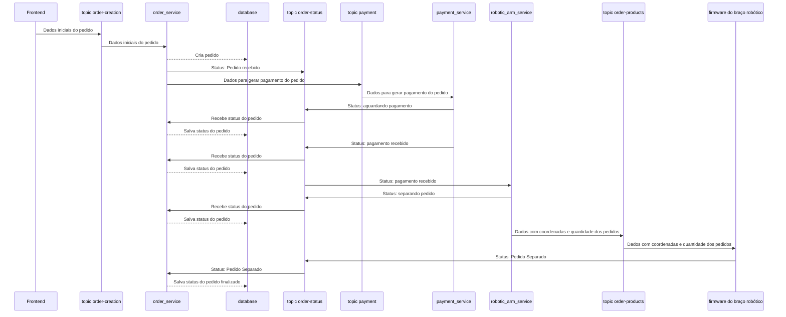

# grabber-backend
Backend repository for the robotic arm project

## Diagrama representando comunicação entre os tópicos e os microserviços

Diagrama representando o fluxo de um pedido que foi realizado corretamente e houve sucesso em todas as etapas do pedido

## Milestones

Cada parte destacada representa um pedaço do software que deverão ser construidos e testados.
Essa divisão torna possível o desenvolvimento em paralelo de cada parte.

### Fluxo do Pedido

